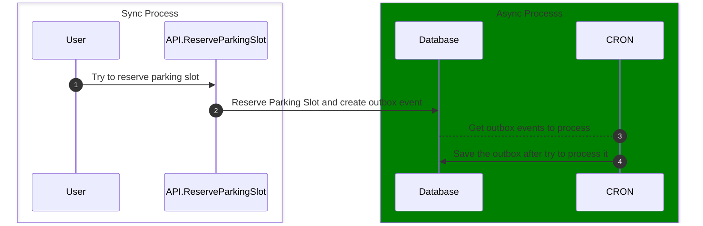

# Demo NestCLS Transacional - Unit Of Work - Transaction In Nestjs Made Easy

Since I started creating automated tests back in 2022, specifically with integration tests, one of the hardest experiences I had was with Node.js, while the best one was with C#/.NET. However, recently I found a way to solve this pain when using Node.js, and I created a small demo focused on integration tests to see how it works.

## What is this app?

It's a simple API where a user can reserve a parking slot, mark that they have finished using the reservation they made, and for every action the user performs, an outbox event is created. Later on, this event is consumed by the cron job, which does something with the events — in our case, it just logs them.

## Test

